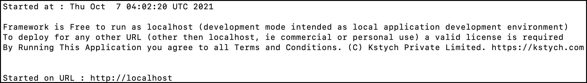

# Getting Started

<font color='#7540EE'>

1. [Installation](#installation)
    - [Meet Ksytych](#meet-ksytych)
    - [Why Ksytych?](#why-ksytych)
1. [Start the Kstych Framework](#start-the-kstych-framework)
    - [Initial Setup](#initial-setup)
    - [Installing Kstych on Linux](#installing-kstych-on-linux)
    - [Installing Kstych on macOS](#installing-kstych-on-macos)
1. [Next Steps](#next-steps)

</font>
- - - -

## Installation

### Meet Ksytych

Ksytych is a low-code platform for developers to develop applications faster.

Some of the built-in features of this framework include:

- Schema Builder
- Automatic CRUD
- Automatic MVC
- Powerful Engine Workflow

### Why Ksytych?

The purpose of Ksytych framework is to reduce the boilerplate code by replacing the fragility of manually defining monotonous routings, controllers, model definitions, etc. Using the Ksytych framework you can get rid of memorizing the annotations at the Controller or method levels.

## Start the Kstych Framework

### Initial Setup

You can run your Kstych application using <a href="https://www.docker.com/" target="_blank">Docker</a>.

Docker is a tool for running applications and services in small, light-weight "containers" which do not interfere with your local computer's installed software or configuration. This means you don't have to worry about configuring or setting up complicated development tools such as web servers and databases on your personal computer. To get started, you only need to install <a href="https://www.docker.com/products/docker-desktop" target="_blank">Docker Desktop</a>.

<!--<aside class="note"><b>Note:</b>You must also have <a href="https://git-scm.com/book/en/v2/Getting-Started-Installing-Git" target="_blank">GIT</a> installed on your machine.
</aside>-->


### Installing Kstych on Linux

If you're developing Kstych application on Linux and <a href="https://docs.docker.com/engine/install/ubuntu/" target="_blank">Docker</a> is already installed, you can use a simple terminal command to create a new Kstych project. For the purpose of the demonstration, let's create a simple "Blog application" in the directory named `BlogPost`.

1. Run the following commands in your terminal:

        git clone https://github.com/kstych/framework
        sudo su
        cd framework

1. Run the `kstych.sh` script file and wait for the server to start.

    ```powershell
    ./kstych.sh
    ```

1. Once the server is started, you would see an output similar to the following:

    

1. Open your browser and type `http://localhost` in the browser search bar. You would be prompted with the LoginID and Password. Log in using `admin` and `yb9738z` as the default credentials.

    

### Installing Kstych on macOS

If you're developing Kstych application on macOS and <a href="https://docs.docker.com/engine/install/ubuntu/" target="_blank">Docker</a> is already installed, you can use a simple terminal command to create a new Kstych project. For the purpose of the demonstration, let's create a simple "Blog application" in the directory named `BlogPost`.

1. Run the following commands in your terminal:

        git clone https://github.com/kstych/framework
        sudo su
        cd framework

1. Ensure that the Kstych framework is running in your Docker dashboard.

    

1. Run the `kstych.sh` script file and wait for the server to start.

    ```powershell
    ./kstych.sh
    ```

1. Once the server is started, you would see an output similar to the following:

    

1. Open your browser and type `http://localhost` in the browser search bar. You would be prompted with the LoginID and Password. Log in using `admin` and `yb9738z` as the default credentials.

    

## Next Steps

Now that you have started the Kstych framework, it is recommend that you become familiar with how the Laravel works, as the Kstych framework is built on Laravel.

Following Laravel documentation would help you kick start building your first Kstych application.

- <a href="https://laravel.com/docs/8.x/lifecycle" target="_blank">Request Lifecycle</a>
- <a href="https://laravel.com/docs/8.x/configuration" target="_blank">Configuration</a>
- <a href="https://laravel.com/docs/8.x/structure" target="_blank">Directory Structure</a>

